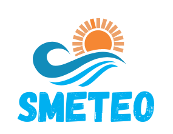
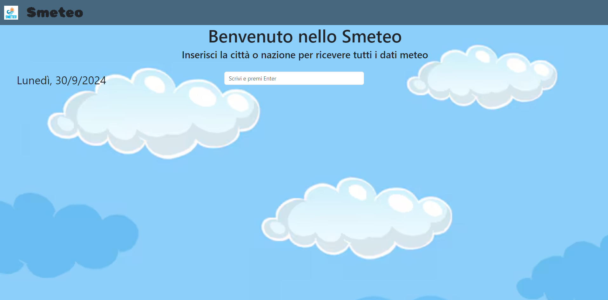
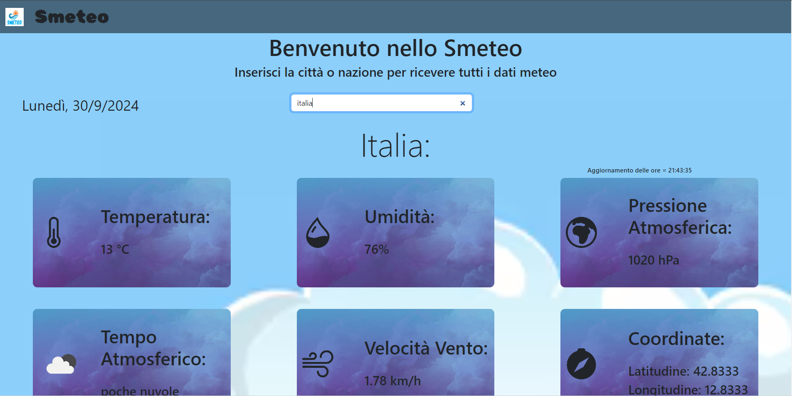
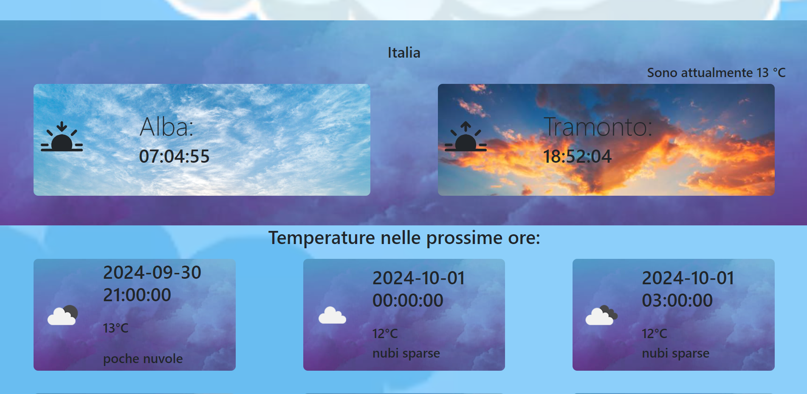
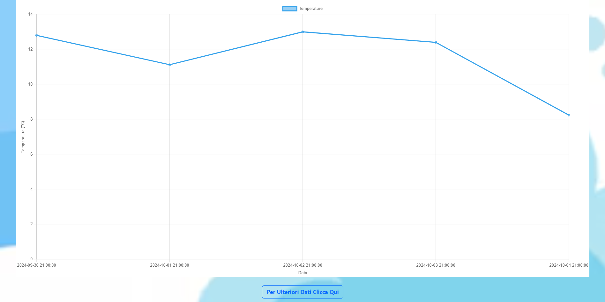
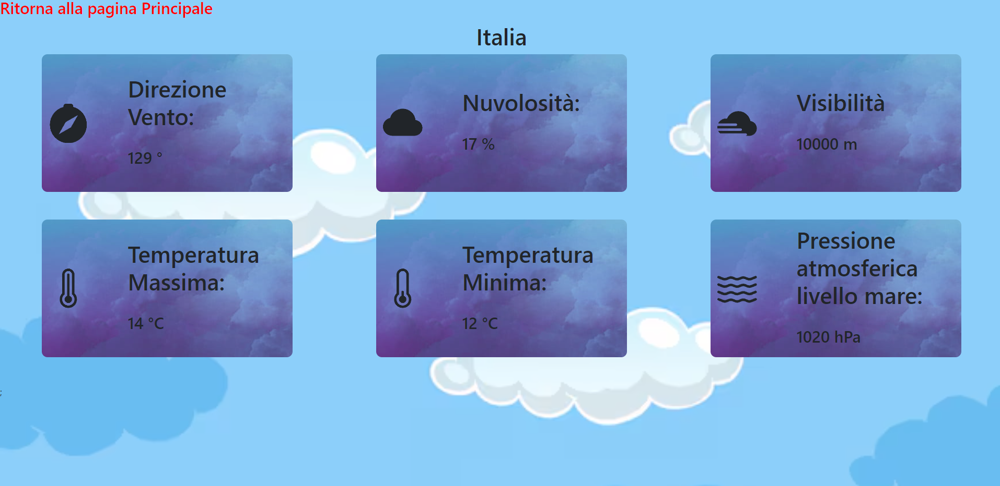

<h1>Smeteo</h1>
Progetto realizzato con React redux, react-router-dom, bootstrap.  
Per visualizzare il progetto correttamente vai su <a href="https://home.openweathermap.org/users/sign_in">OpenWeather API</a> registrati e per email ricevere la chiave Api.
Sostituisci la chiave Api appena ottenuta con la scritta {API_KEY} nella pagina MoreInfo.jsx e nel components MainComponents.jsx nella constante url.

<h3>Homepage:</h3>

Inserisci il nome della citta o nazione per cercare tutti i dati meteo.

Esempio di come si visualizzera la parte alta della pagina quando verrà inserito il nome di una nazione

Nella parte bassa della pagina sotto il grafico delle temperature dei prossimo giorni troverai il bottone Ulteriori Dati, cliccandoci verrai reindirizzato ad un'altra pagina con altri dati metereologici non presenti nella prima pagina (Creato principalmente per usare redux passando come dato il nome della citta o nazione).
